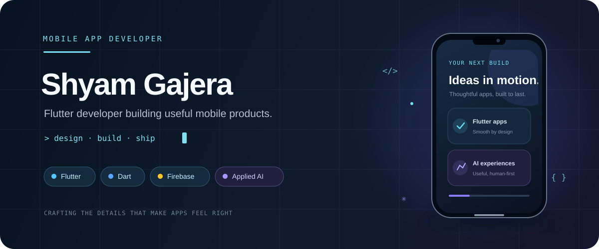
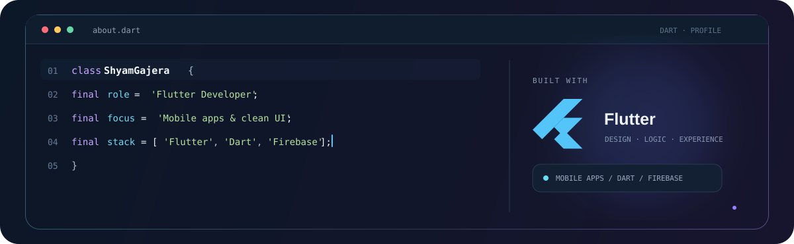
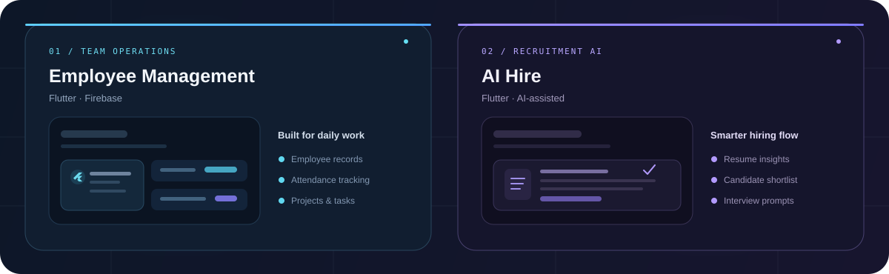

  

 

## ✦ About me

  

I’m **Shyam**, a Flutter developer focused on polished mobile experiences, clear app logic, and reliable integrations.

 

## ✦ Selected work

  

**Employee Management** · Flutter & Firebase · Team records, attendance, and task workflows 
**AI Hire** · Flutter · Resume insights, candidate shortlisting, and interview support

## ✦ Tools I use

Thanks for stopping by · <a href="https://github.com/shyamgajera1407">Explore my GitHub</a>

